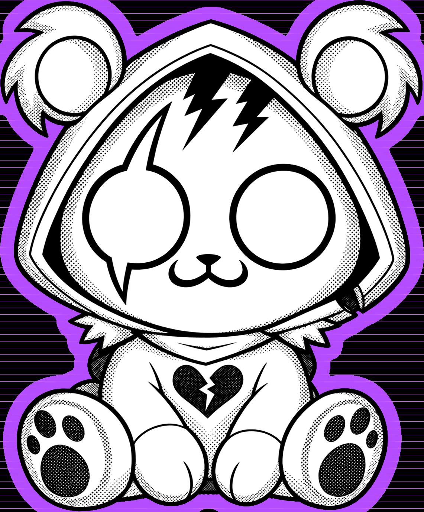
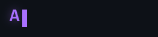
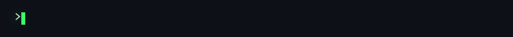
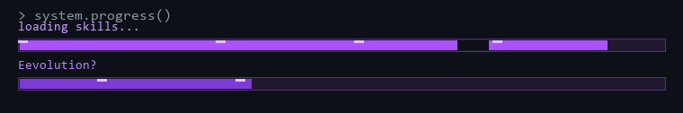
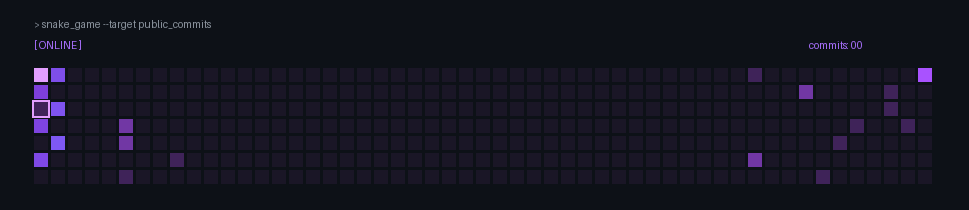

<div align="center">





### Estudante de Engenharia de Software · explorando mundos através do código


<p>
  <a href="https://www.linkedin.com/in/antonio-pedro-guimarães-a58099227"></a>
  <a href="mailto:antoniopedroguimaraes2003@gmail.com"></a>
</p>

</div>

<div align="center">



</div>

<br />

## 🟣 Sobre mim

```cpp
class AntonioPedro {
public:
    string role = "Estudante de Engenharia de Software";
    string mood = "criativo, curioso e sempre aprendendo";
    string currentQuest = "construir projetos que sejam úteis e divertidos";
};
```

Sou estudante de Engenharia de Software e gosto de entender como as coisas funcionam, desde a lógica por trás de um programa até a experiência de quem vai utilizá-lo. Meu objetivo é evoluir constantemente, criar projetos cada vez melhores e transformar ideias em experiências digitais com personalidade.

## 🎓 Educação

- 📚 **Engenharia de Software** — IFPE, previsão de conclusão: **2027**
- 🧠 Atualmente aprofundando meus conhecimentos em programação, desenvolvimento de sistemas e construção de projetos reais.

## ⚙️ Tecnologias

<div align="left">


</div>

<div align="center">



</div>

## 🐍 Snake.exe — commit hunter

<div align="center">



</div>

> cada commit alimenta a cobrinha. cada bug vira um novo boss. 👾
## 🚀 Projetos

> Em breve: projetos selecionados, experimentos e quests concluídas.

| Projeto | Descrição | Tecnologias |
| :--- | :--- | :--- |
| **Projeto em construção** | Um novo projeto está sendo preparado | `em breve` |

<!--
Modelo para adicionar projetos:
| [Nome do projeto](LINK) | Breve descrição do que ele faz | `C++` `Python` |
-->

## 🎧 No meu Spotify

<div align="center">

> Em breve vou adicionar meu perfil/playlist por aqui. 🎶

</div>

<br />

<div align="center">

### `> continue? [Y/n]`


</div>
